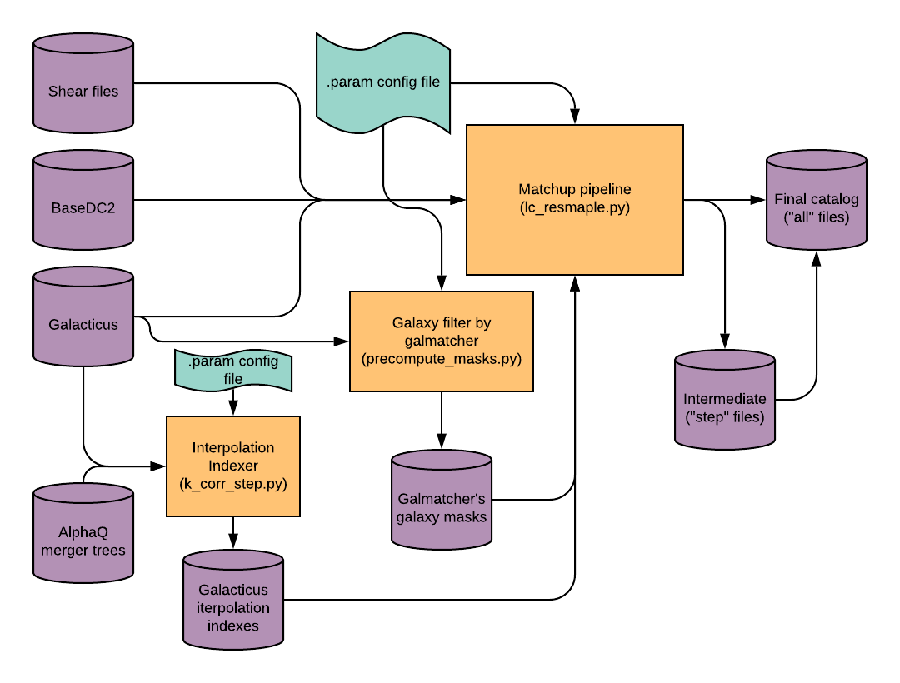
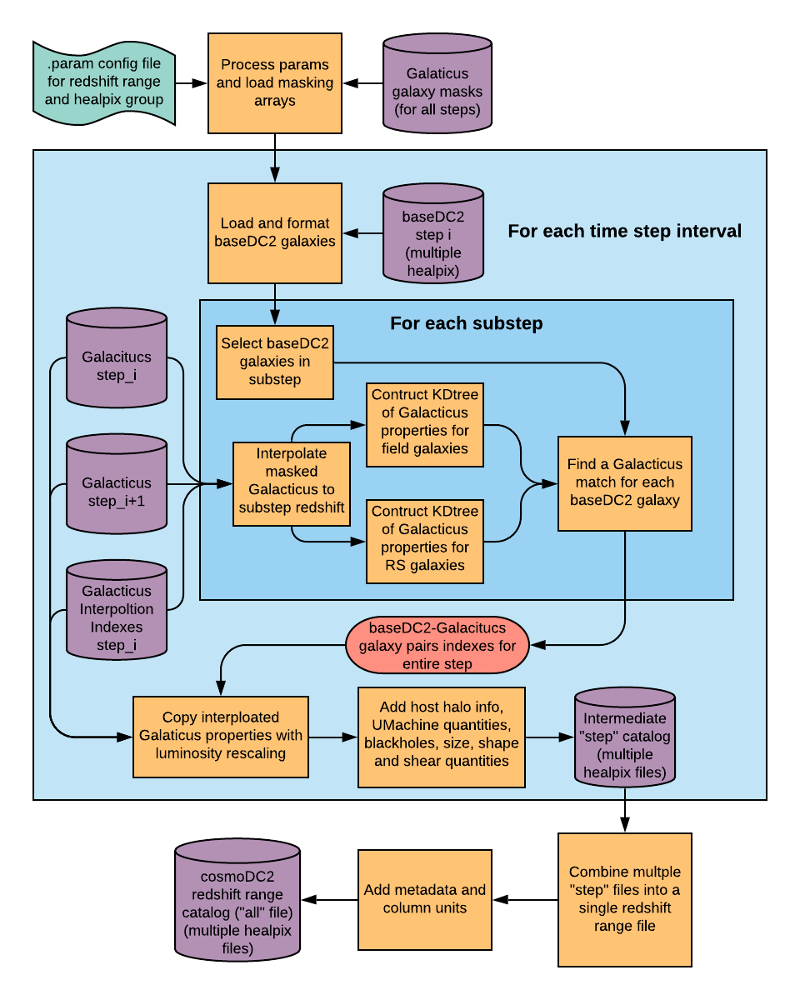

Light Cone Resampling of Galacticus Galaxies
============================================

This package combines baseDC2 and Galacticus catalogs to produce
cosmoDC2. 

There is a description of each file in
[FILE_DESCRIPTION.md](FILE_DESCRIPTION.md). Most files are diagnostics
or plotting routines.

Blackbox Overview
=================

There is one main executable script (`lc_resample.py`) for producing
cosmoDC2 catalogs and two executable scripts (`precompute_masks.py`,
`k_corr_step.py`) for generating precomupted quantities required by
the main pipeline. 

Each script takes in a single configuration/parameter file that
specifies input/output file locations and various run
settings. `lc_reample.py` and `k_corr_step.py` runs off .param files
located in `param_lc_resamp/..` and `param_k_corr/...`,
respectively. `precompute_mask.py` runs off the same .param file as
`lc_resample.py`. A full description of the parameter files and can be
found in [PARAM_DESCRIPTION.md](PARAM_DESCRIPTION.md)

lc_resample.py
--------------

precompute_masks.py
-------------------

k_corr_step.py
--------------

Internal Overview
=================

There are bunch of internal processes 

