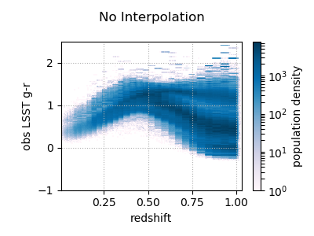
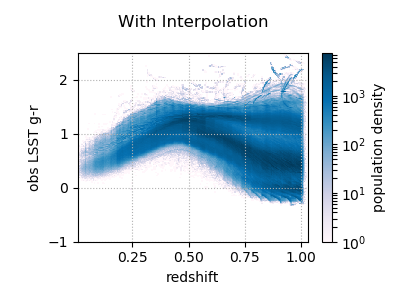

Light Cone Resampling of Galacticus Galaxies
============================================

This package combines baseDC2 lightcone and Galacticus galaxy catalogs to produce
the cosmoDC2 galaxy catalog.  

There is a description of each file in
[FILE_DESCRIPTIONS.md](FILE_DESCRIPTIONS.md). Most files are diagnostics
or plotting routines.

Broad Overview
=================

The main matchup pipeline is `lc_resample.py` which produces
the cosmoDC2 catalogs. The matchup pipeline requires two preproccess data sets to run: precomputed masks produced by `precompute_masks.py` and indexes to identify the same galaxies in Galacticus across time steps produced by `k_corr_step.py`.

Each script takes in one argument which is a single configuration/parameter file that
specifies input/output file locations and various run
settings. `lc_reample.py` and `k_corr_step.py` runs off .param files
located in `param_lc_resamp/..` and `param_k_corr/...`,
respectively. `precompute_mask.py` runs off the same .param file as
`lc_resample.py`. A full description of the parameter files and the settings in them can be
found in [PARAM_DESCRIPTIONS.md](PARAM_DESCRIPTIONS.md)

Precomputed Galaxy Masking, `precompute_masks.py`
-------------------
Not all Galacticus galaxy have reasonable colors or other properties. Galaxies with unreasonable properties are excluded from being used in the match up process. Eve's Galmatcher package determines which galaxies are acceptable. Unacceptable galaxies are excluded by applying a mask to the Galacticus galaxy array. Unless the Galacticus catalog or Galmatcher's requirements change, the masks only needs to be generated once.

`precompute_masks.py` runs on the same .param file as for `lc_resample.py`. The param file specifies Galacticus files locations, time steps and output mask location (the mask location is an input for `lc_resample.py`)

Precomputed Galacticus Interpoliation Indexes, `k_corr_step.py`
--------------
A core feature of the match up pipeline is the redshift interpolation of Galacticus galaxy properties. The Galacticus catalog only has descrete redshifts while we have continous redshifts in the baseDC2 lightcone. If galaxy properties are not interpolated, there will be descrete bands in color-z plots, see figures below.

The redshift interpolation requires to find the same galaxy in two adjacent time step Galacticus catalogs. The order of galaxies are not the same, so an indexing array is created to reorder step_i+1 catalog order to match step_i, see table below for an example. 
| step_i | step_i+1 | indexing | reorder step_i+1|
|--------------------| -- | -- | -- |
| galaxy_0 | galaxy_3 | 5 | galaxy_0 |
| galaxy_1 | galaxy_1 | 1 | galaxy_1 |
| galaxy_2 | galaxy_4 | -1| - |
| galaxy_3 | galaxy_5 | 0 | galaxy_3 |
| galaxy_4 | galaxy_6 | 2 | galaxy_4 |
|      | galaxy_0 |  | |

There are a couple complications:
* Central galaxies in Galacticus don't have unique ids--only satellite galaxies keep the same id between timesteps. To track centrals we have to load in the halo merger trees to figure out where central galaxies go. 
* Not each galaxy exists the following time step, such as galaxy_2. This galaxy is simply excluded from the match up pipeline.
* A galaxy may fail Galmatcher's color cuts for either step_i or step_i+1 but not both. To make sure a galaxy isn't interpolated into cut region, that galaxy is excluded from the matchup.

Matchup Pipeline, `lc_resample.py`
--------------
 This is main body of the pipeline that does the matchup and generates the cosmoDC2 catalog. Like the other scripts, it takes in a single argument which is a paramter file. The .param file describes run time options and all input/output file locations. A full description of the param file can be found in [PARAM_DESCRIPTIONS.md](PARAM_DESCRIPTIONS.md). The pipeline takes in lighcone baseDC2, the Galaticus library, lightcone shears, precomputed masks and interpolation indexes. The lightcone shears need to have exactly the same file structure and galaxy order as baseDC2. The pipeline produces intermediate files for each time step interval and the final catalog. The intermediate files can be deleted afterwards or kept to skip a part of the pipeline during a rerun. A full description of what goes on inside the matchup pipe is below.

Internal Overview of the Matchup Pipeline, `lc_resample.py`
=================

There are bunch of internal processes 

